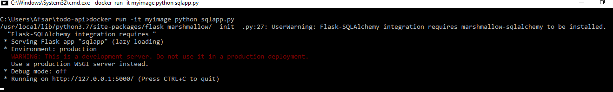
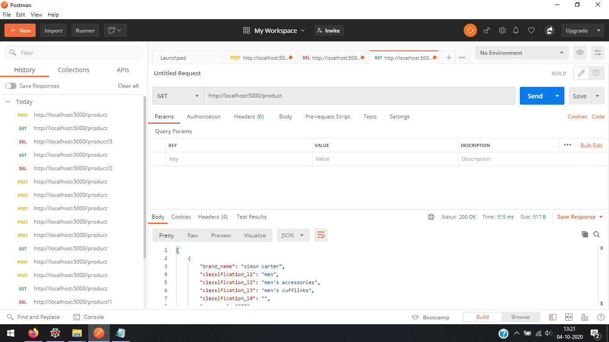

REST API With Flask & SQL Alchemy && Docker
=======

> Products API using Python Flask, SQL Alchemy and Marshmallow, or Run using Docker

## Quick Start Using Pip

``` bash

# Install dependencies
$ pip install -r requirements.txt

# Create DB
$ python
>> from app import db
>> db.create_all()
>> exit()
$ python sqlapp.py
```

## Quick Start Using DOCKER
The way to get our Python code running in a container is to pack it as a Docker image and then run a container based on it. The steps are sketched below.
(docker)(dcr.png)
To generate a Docker image we need to create a Dockerfile which contains instructions needed to build the image. <br>
The Dockerfile is then processed by the Docker builder which generates the Docker image.<br>
Then, with a simple docker run command, we create and run a container with the Python service.

#### how to deploy using docker
create a dockerfile with no extension<br>
$ touch Dockerfile and fil the requirements as shown below<br>

```Dockerfile
FROM python:3.7

WORKDIR /user/src/app
COPY requirements.txt .
RUN pip install -r requirements.txt
COPY ./sqlapp.py /user/src/app

```
- after saving the file run the following command <br>
$ docker build -t myimage .<br>


- if you want to see docker image<br>
$ docker images<br>
you will see myimage there<br>

to run the docker image<br>
$ docker run -d -p 5000:5000 myimage<br>
$ curl http://localhost:5000<br>
<br>
or run <br>
$ docker run -it myimage python sqlapp.py<br>



## Postman
you need postman(https://www.postman.com/downloads/) to perform the queries like insert( method-> POST) , Update ( method-> PUT)  , Fetch ( method-> GET) , Delete ( method-> DELETE) 

- Open POSTMAN
- On the Right side you will find untitled request 
- First select Method as POST in search bar fill http://localhost:5000/product. go to header . Fill Key as Content-type and value as Application/JSON<br>
----------------------------------------------------------------------------------------------------------------------------------------------------------
- Now go to body Fill data like this you need to fill detail as name type STR,  regular_price_value TYPE INT, currency TYPE INT, classification_l1 TYPE STR,classification_l2 TYPE STR,classification_l3 TYPE STR, classification_l4 TYPE STR,image_url TYPE STR<br>
$ { "name": "updated", "brand_name": "icandy", <br>
"regular_price_value": 1080.0, "offer_price_value": 1080.0,<br>
"currency": "GBP",<br>
"classification_l1": "baby & child",<br>
"classification_l2": "buggies & travel",<br>
"classification_l3": "pushchairs & prams", <br>
"classification_l4": "",<br>
"image_url": "https://johnlewis.scene7.com/is/image/JohnLewis/237781332?"}<br>
---------------------------------------------------------------------------------------------------------------------------------------------------------
- Now click send and data insert successfully youll find success code 200 and data will be printed in response container as well

## Endpoints

* GET     /product
* GET     /product/:id
* POST    /product
* PUT     /product/:id
* DELETE  /product/:id
#### POST


#### PUT


#### GET


#### DELETE


